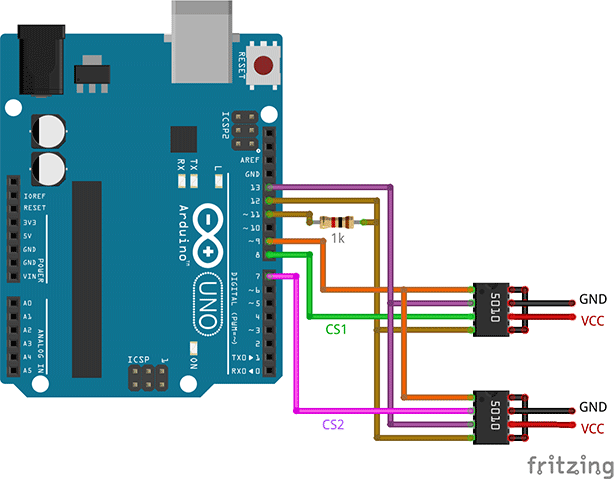

# TLE5010
TLE5010 ([datasheet](https://datasheetspdf.com/pdf-file/914265/Infineon/TLE5010/1)) is a 360° GMR angle sensor that detects the orientation of a magnetic field.
It provides 16-bit values of sine and cosine angle components, which can be converted into value representing angle of magnet rotation.  
TLE5011 ([datasheet](https://www.infineon.com/cms/en/product/sensor/magnetic-sensors/magnetic-position-sensors/angle-sensors/tle5011/#!?fileId=db3a30432ee77f32012f0c4368b5110e)) sensor seems to be compatible.  

This Arduino library allows to read sensor values from TLE5010.  
Communication is done using hardware SPI, or bitbang 3-wire SSC interface.  
Library implements only basic TLE5010 functionality.  
No test modes, temperature measuring, crc checking, filtering, etc, only reading sine and cosine values and angle calculation.

## Hardware.

### Sensor pins:


Supply voltage is 5v.

### Sensor/magnet position:


### Setting up.

Provide clock signal (4MHz square wave, 50% duty) on CLK pin of TLE5010.  
You can use one of Arduino timers to generate this signal on Arduino pin (see [code below](#CLK)), or some external generator if you want to save a pin.  
On figures below it is assumed that CLK signal is generated on pin 9.  

2 types of connection are possible: 

- **Hardware SPI**. 
Fastest communication. Use SCK/MISO/MOSI pins of Arduino (see [here](https://www.arduino.cc/en/Reference/SPI))  and any other pin as CS.  
Connect MOSI to DATA through resistor ~1kOhm (**necessary**!), and MISO to DATA directly.


- **Bitbang**. 
If you want to save one pin, or can not use SPI pins, you can use bitbang mode.  
Communication is slower, but you can use any 3 Arduino pins for CS/SCK/DATA.


Optional: add protection resistors (100-200 Ohm) on each line, pullup resistors (~10kOhm) on DATA and CS lines, decoupling capacitor (~100nF) between VCC and GND.  
With SPI mode, DATA line pullup resistance must be significally greater (~5-10x) than MOSI-DATA resistor, otherwise it will disturb communication.


## Library usage: 
	
Create instance and initialize:

```cpp
TLE5010_SPI sensor(PIN_CS); //SPI mode. PIN_CS - Arduino pin 
sensor.begin();						
```

or 

```cpp
TLE5010_BB sensor(PIN_CS, PIN_SCK, PIN_DATA); //Bitbang mode. PIN_CS, PIN_SCK, PIN_DATA - Arduino pins
sensor.begin();
```
	
<a name='CLK'></a>
Provide clock signal:

```cpp
//4MHz CLK signal on pin 9 of Arduino Uno/Mini/Nano/Leonardo/Micro/ProMicro:
//Timer1 in CTC mode, top=OCR1A, no prescaling (16MHz), toggle OC1A on compare match.
TCCR1A=(0<<COM1A1) | (1<<COM1A0) | (0<<COM1B1) | (0<<COM1B0) | (0<<WGM11) | (0<<WGM10);
TCCR1B=(0<<ICNC1) | (0<<ICES1) | (0<<WGM13) | (1<<WGM12) | (0<<CS12) | (0<<CS11) | (1<<CS10);
OCR1A=1;
ICR1=0;
pinMode(9,OUTPUT);
```

Read data:

```cpp
double angleRadians=sensor.readAngleRadians();  //floating-point angle value in radians, range -PI..0..PI 
double angleDegrees=sensor.readAngleDegrees(); 	//floating-point angle value converted to degrees, range -180..0..180. 
```	

You can also get raw sine/cosine values:

```cpp
sensor.readXY();
int16_t x=sensor.x;	//signed 16-bit cosine value
int16_t y=sensor.y;	//signed 16-bit sine value
```

`.readXY()` method only receives sine/cosine values (no angle calculation).  
It is internally called in other read methods, so X/Y values are updated after every read.

SPI mode calls `SPI.begin()` internally. This disables direct manipulation of SPI pins.  
If you need to work with SPI pins when TLE5010 is not used, call `SPI.end()` to release pins and `SPI.begin()` when you need to work with sensor or other SPI devices again.

```cpp
sensor.begin();
SPI.end();

digitalWrite(SCK, 1);
...

SPI.begin();
angle=sensor.readAngleRadians();
```

## Multiple sensors.



Multiple sensors can share SCK, DATA and CLK pins.  
CS pins must be different.

```cpp
TLE5010_SPI sensor1(PIN_CS_1); //Arduino pin connected to CS pin of sensor #1
sensor1.begin();				
TLE5010_SPI sensor2(PIN_CS_2); //Arduino pin connected to CS pin of sensor #2
sensor2.begin();
...
```

Instead of using multiple instances, you can use one instance for multiple sensors.  
Just change CS pin before calling read methods:

```cpp
sensor.setCS(PIN_CS_1);				//Arduino pin connected to CS pin of sensor #1
angle1=sensor.readAngleRadians();
sensor.setCS(PIN_CS_2);				//Arduino pin connected to CS pin of sensor #2
angle2=sensor.readAngleRadians();
...
```

## Speed.

SPI mode (`TLE5010_SPI` class) is fastest, because it is hardware-driven. `.read()` takes about 36us (Arduino Uno).   
Bitbang mode (`TLE5010_BB` class) uses direct port manipulation routines for bitbang. `.read()` takes about 100us.  

## Alternate angle calculation algorithms for speedup

Sensor does not provide direct value of angle, it reads values of sine and cosine components. (see [datasheet](https://datasheetspdf.com/pdf-file/914265/Infineon/TLE5010/1))  
Once these values are received from sensor, MCU should calculate angle using arctangent (atan2) function.  
This consumes some time. By default `atan2` function from math.h is used, and it takes about 200us to compute.  
You can trade accuracy for speed by switching to faster alternate atan2 algorithms.  
Alternate atan2 function can be specified during initialization:

```cpp
sensor.begin(_atan2ApproxA);
```

or at any time:

```cpp
sensor.atan2Func=_atan2ApproxA;
```

or as a parameter for `.readAngleRadians()`/`.readAngleDegrees()`:

```cpp
sensor.readAngleRadians(_atan2ApproxA);		//use specified function only in this call
```

List of included alternate atan2 functions:


Function name    | Time     | Error*, max        | Error*, average   	| RAM lookup table
---				 |      ---:|:---:				 |:---:					|---:
`_atan2CORDIC18` | ~156 us	|~0.01 deg (0.004%)  |~0.003 deg (0.0008%)	| 32 bytes
`_atan2CORDIC16` | ~128 us	|~0.02 deg (0.006%)  |~0.005 deg (0.0014%) 	| 28 bytes
`_atan2CORDIC14` | ~104 us	|~0.07 deg (0.02%)   |~0.02 deg (0.006%)  	| 24 bytes
`_atan2CORDIC12` | ~84 us	|~0.29 deg (0.08%)   |~0.09 deg (0.024%)  	| 20 bytes
`_atan2CORDIC11` | ~76 us	|~0.43 deg (0.12%)   |~0.13 deg (0.036%)  	| 9 bytes
`_atan2CORDIC10` | ~68 us	|~1.07 deg (0.3%)    |~0.34 deg (0.093%)  	| 8 bytes
`_atan2CORDIC9`  | ~56 us	|~1.75 deg (0.48%)   |~0.55 deg (0.15%)   	| 7 bytes
`_atan2CORDIC8`  | ~48 us	|~3.48 deg (0.97%)   |~1.11 deg (0.3%)    	| 6 bytes
`_atan2ApproxA`  | ~80 us 	|~0.2 deg  (0.06%)   |~0.14 deg (0.04%)   	| 
`_atan2ApproxB`  | ~110 us  |~0.09 deg (0.024%)  |~0.06 deg (0.015%)  	| 
* Error compared to default atan2
	
Or use custom function:

```cpp
double customAtan2(int16_t y, int16_t x){...};	//function must take 2 int16_t arguments and return double
sensor.atan2Func=customAtan2;
```

## Integer output.

In some cases angle value in radians/degrees is not needed and dimensionless integer value of certain bitdepth is enough.  
Method `.readInteger()` is available to calculate integer angle value.  
Usage of some algorithms (CORDIC) allows to avoid floating-point operations (faster).  
By default this method is a stub and returns 0.  
atan2 function with integer output must be specified before calls to `.readInteger()`:

```cpp
sensor.atan2FuncInt=_atan2Int16;
int16_t angle=sensor.readInteger();
```

or as parameter for `readInteger()`:

```cpp
int16_t angle=sensor.readInteger(_atan2Int16);	//use specified function only in this call	
```

List of included integer atan2 functions:

Function      | Bitdepth| range		      | Time	| Error max | Error avg	|RAM lookup table
---			  |---:		|:---:			  |---:		|---:		|---:		|---:
`_atan2Int16` | 16 bit	| -32768..0..32767| ~119 us	| ~0.02 deg	| ~0.005deg | 30 bytes
`_atan2Int15` | 15 bit  | -16384..0..16384| ~108 us	| ~0.05 deg	| ~0.01 deg	| 28 bytes
`_atan2Int14` | 14 bit  | -8192..0..8192  | ~99 us	| ~0.08 deg	| ~0.02 deg	| 26 bytes
`_atan2Int13` | 13 bit  | -4096..0..4096  | ~90 us	| ~0.18 deg	| ~0.04 deg	| 24 bytes
`_atan2Int12` | 12 bit  | -2048..0..2048  | ~80 us	| ~0.28 deg	| ~0.07 deg	| 22 bytes
`_atan2Int11` | 11 bit  | -1024..0..1024  | ~72 us	| ~0.54 deg	| ~0.14 deg	| 20 bytes
`_atan2Int10` | 10 bit  | -512..0..512    | ~64 us	| ~0.97 deg	| ~0.27 deg	| 9 bytes
`_atan2Int9`  |  9 bit  | -256..0..256    | ~56 us	| ~1.55 deg	| ~0.46 deg	| 8 bytes
`_atan2Int8`  |  8 bit  | -128..0..128    | ~50 us	| ~2.7 deg	| ~0.86 deg	| 7 bytes

Use of custom function is also possible:

```cpp
int16_t customAtan2Int(int16_t y, int16_t x) {...};	//function must take 2 int16_t arguments and return int16_t
sensor.atan2FuncInt=customAtan2Int;
int16_t angle=sensor.readInteger();	
```